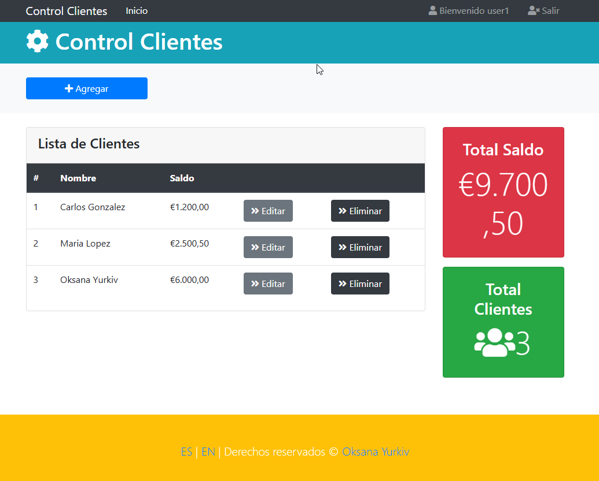

# Proyecto Java: Gestión de Clientes

Este proyecto es una aplicación de gestión de clientes desarrollada en **Java**, utilizando **Spring Boot**, **Thymeleaf
**, **Bootstrap** y **H2 Database**. Permite realizar operaciones CRUD (Crear, Leer, Actualizar y Eliminar) y gestionar
roles de usuarios con **Spring Security**.

---

## Requisitos

Asegúrate de tener instalados los siguientes programas antes de comenzar:

- **Java Development Kit (JDK) 17** o superior.
- **Maven** para la gestión de dependencias.
- **Git** para el control de versiones.

---

## El visual y el uso de la API

### 1. **Login**

Al introducir la contraseña, se encripta y se comprueba el valor encriptado con el valor que
está guardado en la base de datos.
Importante saber: por la seguridad de usuario, nunca se debe guardar el valor real de la contraseña, por eso se usa la
encriptación.

### 2. **Control de clientes**



### 3. **Añadir un cliente nuevo**

Tener en cuenta, que todos los campos son obligatorios, excepto "telefono".


## Explicaciones

### Plantillas: 
En las plantillas "accion.guardar" hace referencia al texto de archivo messages.properties

Si añadimos nuevos botones importante poner bien la ruta, por ejemplo th:href="@{/save}

### Controlador:

* Los GET son para botones, para acceder al formulario.
Tienen que recibir como parametro el objeto Model
* Los POST son acciones de botones del formulario, los que hacen cambios en la base de datos.

## Comandos de Uso

### 1. **Clonar el Repositorio**

```bash
git clone https://github.com
cd gestion-clientes
